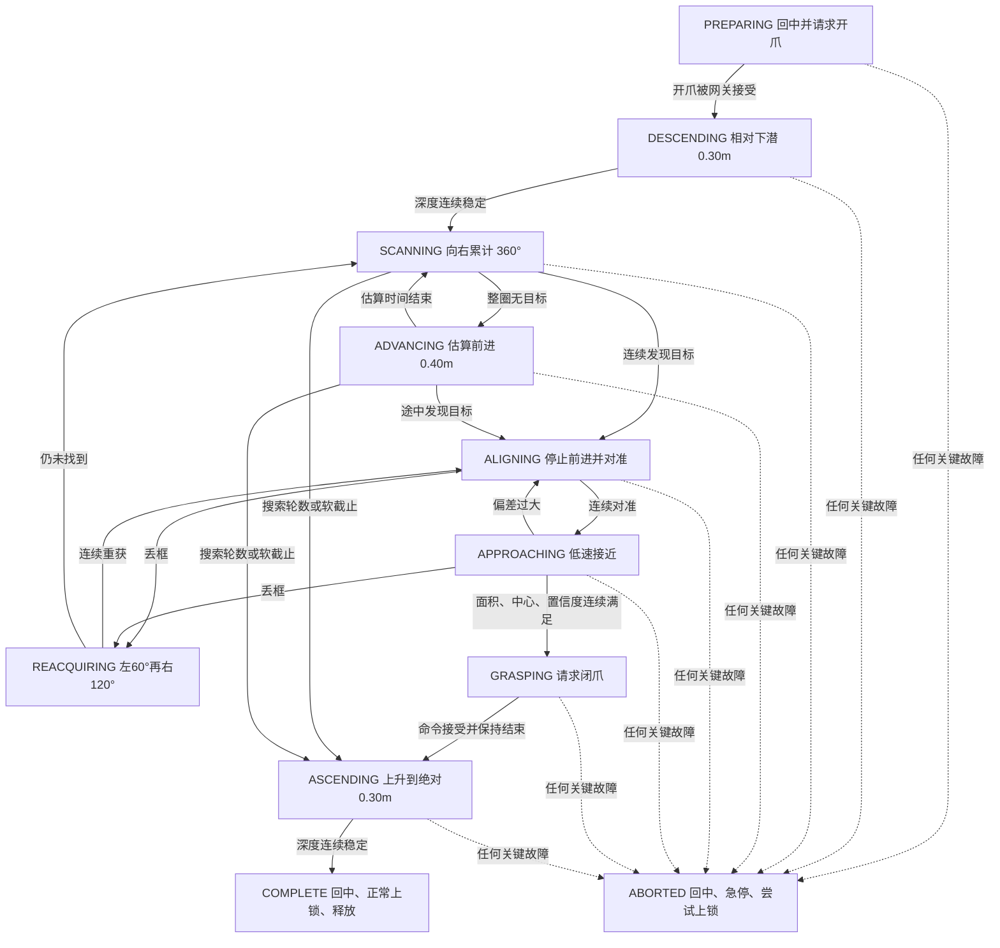

# 自主状态机

## 1. 为什么拆成纯 Python

`rov_competition/mission.py` 不导入 ROS、YOLO、OpenCV 或 MAVLink。它每 0.05 秒接收一次 `MissionObservation`，只输出 `MissionDecision`。这样可以在没有 ROV 的电脑上测试逻辑，也能清楚区分：

- 感知：这一帧看到了什么；
- 状态机：当前应该处于什么阶段；
- 控制意图：希望前后、横移、升沉和偏航多少；
- 网关：当前是否允许把意图发给 ArduSub；
- 飞控：怎样把四轴意图分配到八个推进器。

状态机永远不写八电机混控矩阵。

## 2. 完整状态流



## 3. 各状态的工程含义

### `PREPARING`

四轴保持中位，通过 `/rov/control/set_gripper` 请求开爪。只有服务明确返回接受，才记录这一刻的真实深度。若启动深度为 `1.20 m`，配置的相对下潜为 `0.30 m`，目标就是 `1.50 m`，不是固定去 `0.30 m`。

### `DESCENDING`

使用深度误差做限幅 P 控制。深度在容差内连续稳定后才开始扫描；深度无效、目标超过最大作业深度或下潜超时都会中止。

### `SCANNING`

根据真实航向的相邻变化累计角度。`359° → 1°` 记为向右 `2°`，不是向左 `358°`。航向大跳变、实际方向相反或持续无进展都会中止。

发现候选框后先回中，等待连续新图像确认。重复使用同一帧不会增加计数。

### `ADVANCING`

当前没有 DVL，状态机只能用：

```text
持续时间 = 目标距离 / 同工况下实测平均速度
```

默认是 `0.40 / 0.30 ≈ 1.33 s`，输出是归一化 `0.05`。画面仍持续识别；途中发现目标先停车确认。

### `ALIGNING`

“定身”只表示前进和横移归零，并依靠 `ALT_HOLD` 保持深度/姿态；没有 DVL 时不声称水平位置锁定。

瞄准点默认是画面 `(0.50, 0.70)`。目标在瞄准点的哪一侧会产生图像误差，误差乘以经过实测的 `image_yaw_sign`、`image_vertical_sign` 后才成为偏航和升沉命令。方向为 `null` 时不会猜测。

### `APPROACHING`

以 `approach_forward_command=0.05` 低速接近，并小幅修正偏航和升沉。`desired_approach_speed_mps=0.30` 只是期望记录，不冒充真实速度闭环。

每类目标都有自己的框面积阈值 `k`。只有以下条件同时连续满足多张新图，才请求闭爪：

- 是允许抓取且已经锁定的同一目标；
- 框坐标、尺寸和置信度合法；
- 中心仍在瞄准容差内；
- 面积比达到该类别的 `k`；
- 面积没有异常接近整屏。

### `REACQUIRING`

对准或接近时丢框，先立即停车。超过短暂容忍时间后，按真实航向先左转 `60°`，再从新位置右转 `120°`。重获目标后统一回 `ALIGNING`；仍未找到则清除锁定并重新做 360° 扫描。

### `GRASPING`

只发送一次带时间戳、来源和动作枚举的闭爪服务。保持计时从“网关接受”开始，不从请求发出开始。接受不等于物理抓牢。

### `ASCENDING`

使用真实深度反馈上升到绝对回收深度 `0.30 m`。如果水面波动使 ROV 略浅于该值，状态机不会为了追数值重新下潜。

### `COMPLETE` 与 `ABORTED`

- `COMPLETE`：ROS 节点请求正常上锁，网关回中、上锁并释放控制。
- `ABORTED`：ROS 节点请求急停；急停锁不可自动恢复，必须人工确认后复位。

## 4. 目标选择与锁定

首次获取目标时先按框面积排序，面积相同再按置信度排序。锁定后不会因为另一个更大的框出现就切换，而是结合同类别、IoU、中心距离和最大跳变限制跟踪原目标。

水草不在可抓取列表中。海星是否计分仍应在赛前裁判会上确认；若不计分，应从 `targets.yaml` 删除，而不是只依赖操作员记忆。

## 5. 故障处理

相机断流、感知过期、心跳/遥测过期、模式变化、来源变化、NaN/Inf、航向跳变、夹爪服务拒绝、状态超时或节点退出都会先生成中位命令。活动任务随后调用网关急停并尝试上锁；完全断链仍要依赖 ArduSub failsafe 和物理断电。
